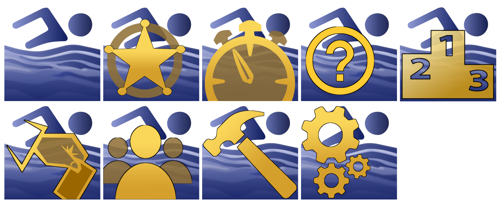

# SCM_Member-R
Manage your club members. Part of the SwimClubMeet eco system of applications to run your swimming meets.

---
SCM_Member is a 32bit application written in pascal. It's part of an eco system of applications that make up the SwimClubMeet project. SCM lets amateur swimming clubs manage members and run their club night's. (A meet manager.)

To learn more about SCM view the [github pages](https://artanemus.github.io/index.html).

If you are interested in following a developer's blog and track my progress then you can find me at [ko-fi](https://ko-fi.com/artanemus).

---

### USING Member

After install, by default, an icon is placed on the desktop. If you elected to disable this, type **member** in the windows search bar to discover it. Else navigate to the **Artanemus** folder on the start bar. (All SCM applications and utilities are located in this folder.)

> Use Windows **Apps and Features** to remove the application.

### ON START-UP

The application will ask you to login to the database. Currently there is no help file for this application. So I offer you these notes.

Use the navigator to browse, edit, insert and delete members.

Editing can be done in both single and grid view.

Note: Members that have a swimming data (nomination, entrant, race-times, etc) can be deleted but the correct method is to archive these members.

---

All data shown here is demo-data. It uses random user names and emails.

Multi-club assignment of members is possible. TBA.

A role (and it's start end dates) can be assigned to a member. Currently, a report for roles hasn't been created - on my todo list. 

The list view. Data can be edited in this grid. Also displayed is the find dialogue.

Check-Data is a new option. It'll list any missing params. 

The default number of data points can be increased or decreased in the options dialogue. (Via the SwimClubMeet core application.) 

